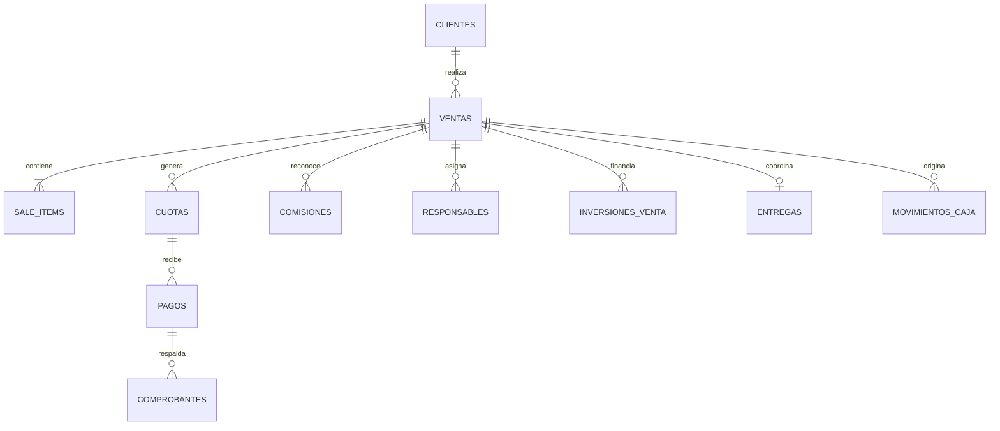

# Amarango OS V3 — Data Contract

## Estado y límite de esta versión

Este documento define el contrato lógico de datos de Amarango OS. **No crea tablas, migraciones, políticas, funciones, credenciales ni escrituras.** V3 permanece en laboratorio y utiliza únicamente datos de prueba.

Reglas obligatorias:

- La tienda V16 es la fuente canónica de productos.
- Amarango OS consulta productos mediante `ReadOnlyProductBridge`; no mantiene otra tabla de catálogo.
- `sale_items` conserva un snapshot histórico. Una modificación futura del catálogo no altera una venta confirmada.
- Costos, proveedores, caja e inversiones son dominios administrativos y requieren autorización de servidor.
- Todos los importes operativos se expresan en ARS enteros. La presentación visual usa `$2.100.000`, nunca abreviaturas.
- Los porcentajes y reglas comerciales se versionarán; V3 no supone fórmulas del CRM Legacy.

## Relación lógica

El diagrama es conceptual. Los nombres físicos y relaciones definitivas requieren auditar el esquema real del CRM Legacy antes de escribir SQL.

## `clientes`

| Campo lógico | Tipo | Obligatorio | Evidencia / criterio |
| --- | --- | --- | --- |
| `id` | ID estable | sí | identidad interna; origen Legacy pendiente |
| `full_name` | texto | sí | nombre del cliente |
| `document_number` | texto nullable | no | DNI visto en CRM Lab; validación pendiente |
| `phone` | texto nullable | no | teléfono visto en CRM Lab |
| `address` | texto nullable | no | requerido por continuidad Legacy |
| `locality` | texto nullable | no | pendiente de evidencia de campo físico |
| `occupation` | texto nullable | no | continuidad operativa; esquema pendiente |
| `references` | lista/relación | no | continuidad operativa; no decidir almacenamiento todavía |
| `notes` | texto nullable | no | observaciones Legacy |
| `created_at` | fecha/hora | sí | fecha de alta; origen pendiente |

## `ventas`

| Campo lógico | Tipo | Obligatorio | Evidencia / criterio |
| --- | --- | --- | --- |
| `id` | ID estable | sí | identidad de la operación |
| `customer_id` | ID | sí | referencia a cliente |
| `reseller_id` | ID nullable | no | preserva venta con/sin revendedor |
| `frequency` | `monthly` / `biweekly` | sí | mensual/quincenal observado |
| `discount_ars` | ARS entero | sí | descuento observado; autorización pendiente |
| `shipping_ars` | ARS entero | sí | envío observado |
| `status` | estado versionado | sí | borrador/confirmada/cancelada/completada propuestos |
| `sold_at` | fecha/hora nullable | al confirmar | fecha histórica de venta |

No se fija todavía la cantidad de cuotas ni la fórmula comercial en `ventas`: el plan debe referenciar una política versionada cuando sea auditada.

## `sale_items` — snapshot histórico

| Campo lógico | Tipo | Obligatorio | Motivo |
| --- | --- | --- | --- |
| `id` | ID estable | sí | identidad de línea |
| `sale_id` | ID | sí | venta propietaria |
| `product_id` | ID V16 | sí | trazabilidad con producto actual |
| `product_name_snapshot` | texto | sí | preserva nombre vendido |
| `model_snapshot` | texto nullable | no | solo si estaba validado |
| `unit_price_ars_snapshot` | ARS entero | sí | precio efectivamente usado |
| `unit_cost_ars_snapshot` | ARS entero nullable | no | costo usado, solo dominio administrativo |
| `supplier_snapshot` | texto nullable | no | proveedor usado al vender |
| `price_updated_at_snapshot` | fecha/hora nullable | no | vigencia conocida del precio |
| `sold_at_snapshot` | fecha/hora | sí | momento confirmado de la operación |
| `snapshot_version` | texto | sí | comienza en `amarango-sale-item/v1` |

El snapshot es append-only desde el punto de vista histórico. Si el producto cambia de nombre, costo, precio o proveedor, la venta conserva los valores confirmados.

## `cuotas`

| Campo lógico | Tipo | Obligatorio | Nota |
| --- | --- | --- | --- |
| `id` | ID estable | sí | — |
| `sale_id` | ID | sí | — |
| `sequence` | entero | sí | número de cuota |
| `due_at` | fecha/hora | sí | admite cronogramas mensual/quincenal |
| `amount_ars` | ARS entero | sí | sin abreviar |
| `status` | estado | sí | pendiente/parcial/pagada/vencida/cancelada |

La generación del cronograma queda pendiente de auditar planes, feriados, redondeos y tolerancias del CRM Legacy.

## `pagos`

| Campo lógico | Tipo | Obligatorio | Nota |
| --- | --- | --- | --- |
| `id` | ID estable | sí | — |
| `customer_id` | ID | sí | trazabilidad 360 |
| `sale_id` | ID nullable | no | permite imputación posterior controlada |
| `installment_id` | ID nullable | no | permite pagos parciales/no imputados |
| `amount_ars` | ARS entero | sí | — |
| `paid_at` | fecha/hora | sí | — |
| `receipt_id` | ID nullable | no | comprobante asociado |

## `revendedores` y `comisiones`

| Entidad | Campos mínimos propuestos | Pendiente crítico |
| --- | --- | --- |
| `revendedores` | `id`, `display_name`, `active` | identidad real, estado, relación con usuarios |
| `comisiones` | `id`, `sale_id`, `reseller_id`, `base_amount_ars`, `percentage`, `amount_ars`, `status` | fórmula, contado/cuotas, pagos parciales, autorización |

No se codifica en este contrato la regla 10%/15% ni ningún reparto observado fuera del código fuente del CRM Legacy. Debe validarse comercial y técnicamente antes de activarla.

## Responsables múltiples

`responsible_assignments` separa la venta de sus responsables:

| Campo | Tipo |
| --- | --- |
| `id` | ID estable |
| `sale_id` | ID de venta |
| `responsible_user_id` | ID de usuario interno |
| `responsibility` | texto/enum a auditar |

La tabla puente evita limitar una operación a una sola persona y conserva la responsabilidad específica de cada participante.

## Inversionistas y porcentajes

Se proponen dos entidades separadas:

- `investors`: identidad y estado del inversor.
- `sale_investments`: participación en una venta concreta.

Campos mínimos de `sale_investments`: `sale_id`, `investor_id`, `participation_percentage`, `capital_requested_ars`, `capital_contributed_ars`, `profit_share_ars`, `status`.

Restricciones futuras a evaluar, no implementadas:

- porcentaje total igual a 100%;
- más de dos inversionistas;
- aporte parcial;
- solicitud/rechazo/aceptación;
- devolución de capital y distribución de utilidad;
- correcciones auditables sin reescribir historia.

## `movimientos_caja`

Campos lógicos: `id`, `direction`, `amount_ars`, `occurred_at`, `sale_id`, `payment_id`, `category`, `responsible_user_id`.

Una venta, un pago o una compra pueden originar movimientos, pero no deben recalcularse destruyendo movimientos históricos. Conciliación, cuentas y saldos iniciales quedan pendientes del CRM real.

## `entregas`

Campos lógicos: `id`, `sale_id`, `mode`, `status`, `scheduled_at`, `delivered_at`, `address_snapshot`, `observations`.

La dirección se guarda como snapshot para que un cambio posterior en el cliente no modifique el destino histórico de la entrega.

## `comprobantes`

Campos lógicos: `id`, `storage_reference`, `mime_type`, `created_at`, `uploaded_by_user_id`.

No se define bucket, ruta, permisos ni Storage en V3. El archivo debe quedar privado y asociado mediante relaciones auditables.

## `auditoría`

Campos lógicos: `id`, `actor_user_id`, `action`, `entity_type`, `entity_id`, `occurred_at`, `before_digest`, `after_digest`.

La auditoría será obligatoria para futuras mutaciones administrativas. V3 no registra eventos porque no existen escrituras ni datos reales.

## Límites de acceso previstos

| Dominio | Storefront | Asesor | Administración |
| --- | --- | --- | --- |
| Producto público | lectura | lectura | lectura |
| Costo/proveedor | no | no por defecto | lectura autorizada |
| Clientes/ventas/cuotas | no | alcance asignado futuro | alcance completo futuro |
| Caja/inversiones/auditoría | no | no | acceso administrativo futuro |

La autorización definitiva debe aplicarse en servidor. Ocultar un campo con CSS o JavaScript no es autorización.
